# 互联网资产暴露面检测系统（EASM）设计方案

> **版本**：v1.0  
> **日期**：2025-12-16  
> **文档类型**：系统设计方案

---

## 目录

- [一、系统概述](#一系统概述)
- [二、系统架构设计](#二系统架构设计)
- [三、功能模块详细设计](#三功能模块详细设计)
- [四、工作流编排设计](#四工作流编排设计)
- [五、数据模型设计](#五数据模型设计)
- [六、技术选型建议](#六技术选型建议)
- [七、其他建议模块](#七其他建议模块)
- [八、开发路线图建议](#八开发路线图建议)
- [九、总结](#九总结)

---

## 一、系统概述

### 1.1 系统定位

本系统是一款面向甲方安全团队的**外部攻击面管理（External Attack Surface Management）**平台，旨在以攻击者视角持续发现、监控和评估企业互联网暴露资产的安全风险。

### 1.2 核心目标

| 目标           | 说明                                                 |
| -------------- | ---------------------------------------------------- |
| **资产发现**   | 自动化发现遗漏的互联网资产（子域名、IP、端口、服务） |
| **风险识别**   | 识别暴露资产的安全漏洞和配置风险                     |
| **持续监控**   | 周期性扫描，及时发现新增资产和新增风险               |
| **攻击面收敛** | 提供可视化报告，辅助安全决策                         |

### 1.3 设计原则

| 原则           | 说明                             |
| -------------- | -------------------------------- |
| **分布式架构** | 支持多节点横向扩展，提升扫描效率 |
| **模块化设计** | 各功能模块松耦合，便于维护和扩展 |
| **任务编排**   | 灵活的任务调度和工作流编排       |
| **数据融合**   | 多源数据整合去重，提供统一视图   |
| **安全可控**   | 扫描速率可控，避免影响业务系统   |

---

## 二、系统架构设计

### 2.1 整体架构图

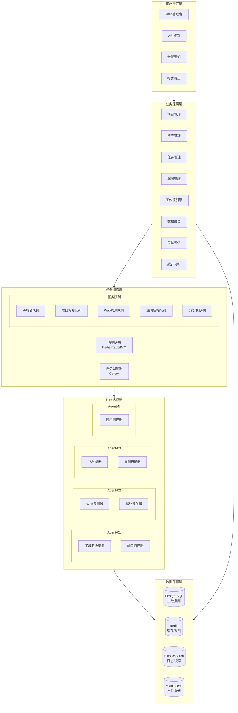

### 2.2 分布式扫描架构

mermaid

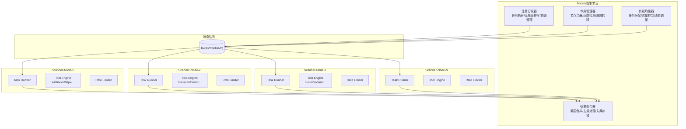

### 2.3 数据流架构

mermaid

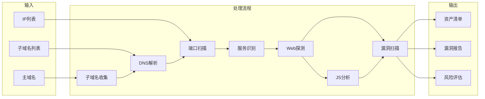

------

## 三、功能模块详细设计

### 3.1 模块总览

mermaid

```mermaid
graph TB
    subgraph 模块1[1. 资产输入模块]
        M1A[主域名导入]
        M1B[IP列表导入]
        M1C[子域名导入]
        M1D[API对接]
    end

    subgraph 模块2[2. 子域名收集模块]
        M2A[被动收集]
        M2B[主动爆破]
        M2C[空间搜索]
        M2D[证书透明度]
    end

    subgraph 模块3[3. 端口扫描模块]
        M3A[端口探测]
        M3B[服务识别]
        M3C[Banner抓取]
        M3D[SSL/TLS分析]
    end

    subgraph 模块4[4. Web资产探测模块]
        M4A[HTTP探测]
        M4B[指纹识别]
        M4C[目录扫描]
        M4D[截图存档]
    end

    subgraph 模块5[5. JS分析模块 - 重点]
        M5A[JS爬取]
        M5B[API提取]
        M5C[敏感信息]
        M5D[接口FUZZ]
    end

    subgraph 模块6[6. 漏洞扫描模块]
        M6A[Nuclei扫描]
        M6B[自定义POC]
        M6C[弱口令检测]
        M6D[配置检查]
    end

    subgraph 模块7[7. 数据融合与报告模块]
        M7A[数据去重]
        M7B[关联分析]
        M7C[风险评估]
        M7D[报告生成]
    end

    模块1 --> 模块2
    模块2 --> 模块3
    模块3 --> 模块4
    模块4 --> 模块5
    模块4 --> 模块6
    模块5 --> 模块6
    模块6 --> 模块7
```

### 3.2 模块一：资产输入与管理模块

#### 功能描述

作为系统的入口，负责接收和管理用户提供的初始资产信息。

#### 子功能设计

mermaid

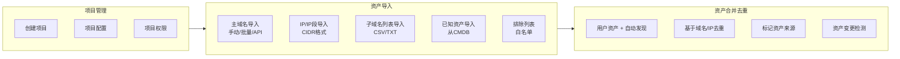

#### 数据模型

```text
Project (项目)
├── id: UUID
├── name: String
├── description: String
├── scan_policy: JSON (扫描策略配置)
├── notification_config: JSON (通知配置)
├── created_at: DateTime
└── updated_at: DateTime

RootDomain (主域名)
├── id: UUID
├── project_id: FK -> Project
├── domain: String
├── source: Enum (manual/api/cmdb)
├── status: Enum (active/inactive)
└── created_at: DateTime

IPRange (IP范围)
├── id: UUID
├── project_id: FK -> Project
├── cidr: String
├── source: Enum
└── created_at: DateTime

ExcludeList (排除列表)
├── id: UUID
├── project_id: FK -> Project
├── type: Enum (domain/ip/url)
├── value: String
└── reason: String
```

### 3.3 模块二：子域名收集模块

#### 功能描述

通过多种方式全面收集目标主域名的子域名。

#### 架构设计

mermaid

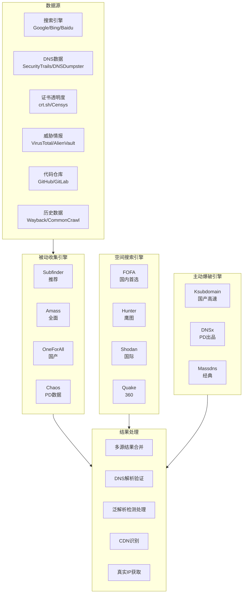

#### 推荐工具集成

| 工具           | 用途     | 特点                                     |
| -------------- | -------- | ---------------------------------------- |
| **Subfinder**  | 被动收集 | ProjectDiscovery出品，速度快，数据源丰富 |
| **Amass**      | 综合收集 | OWASP项目，功能全面，支持主动+被动       |
| **OneForAll**  | 综合收集 | 国产工具，集成大量国内数据源             |
| **Ksubdomain** | 主动爆破 | 国产高速DNS爆破工具，无状态扫描          |
| **DNSx**       | DNS解析  | 批量DNS解析和验证                        |

#### 空间搜索引擎查询语法

| 引擎   | 查询语法示例                  |
| ------ | ----------------------------- |
| FOFA   | `domain="example.com"`        |
| Hunter | `domain.suffix="example.com"` |
| Shodan | `hostname:example.com`        |
| Quake  | `domain:"example.com"`        |

#### 泛解析处理流程

mermaid

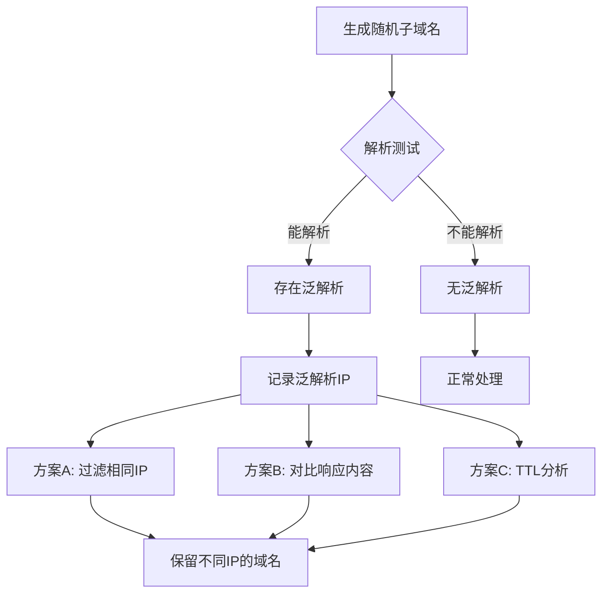

### 3.4 模块三：端口扫描与服务识别模块

#### 功能描述

对发现的IP资产进行端口扫描和服务识别。

#### 扫描策略配置

| 扫描模式   | 端口范围       | 适用场景         |
| ---------- | -------------- | ---------------- |
| 快速模式   | Top 1000 端口  | 快速摸底         |
| 标准模式   | Top 10000 端口 | 日常扫描         |
| 全端口模式 | 1-65535        | 深度扫描（推荐） |
| 自定义模式 | 用户指定       | 特定需求         |

| 速率控制   | PPS   | 适用场景 |
| ---------- | ----- | -------- |
| 保守模式   | 100   | 敏感环境 |
| 标准模式   | 1000  | 日常扫描 |
| 激进模式   | 10000 | 内网扫描 |
| 自适应模式 | 动态  | 自动调整 |

#### 两阶段扫描架构

mermaid

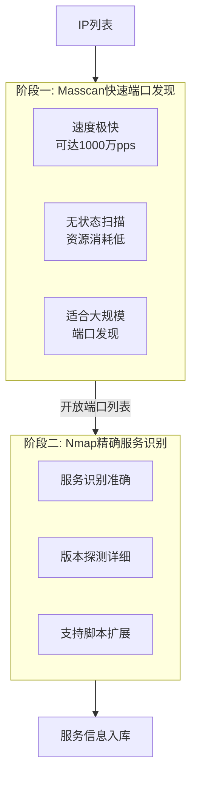

#### 分布式扫描调度流程

mermaid

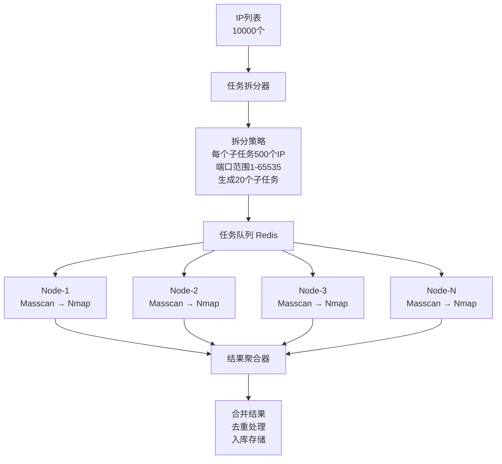

#### 防止卡死机制

| 机制     | 说明                    |
| -------- | ----------------------- |
| 任务超时 | 单任务最大执行时间限制  |
| 心跳检测 | 定期检查扫描进程状态    |
| 断点续扫 | 支持从中断处继续        |
| 死锁检测 | 检测并杀死僵死进程      |
| 资源监控 | CPU/内存/网络使用率监控 |

### 3.5 模块四：Web资产探测模块

#### 功能描述

识别HTTP/HTTPS服务，进行Web指纹识别和目录扫描。

#### 模块架构

mermaid

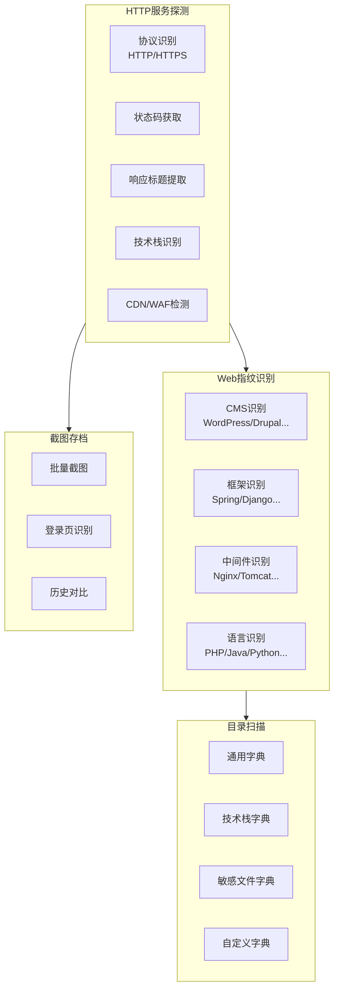

#### 4.1 HTTP服务探测

**工具：httpx (ProjectDiscovery)**

探测内容：

- 协议识别：HTTP/HTTPS
- 状态码：200/301/302/403/404/500...
- 响应标题：Title提取
- 响应长度：Content-Length
- Web服务器：Server Header
- 技术栈：X-Powered-By等
- CDN识别：通过响应头判断
- WAF检测：识别常见WAF

命令示例：

bash

```bash
httpx -l urls.txt -title -status-code -content-length -tech-detect \
      -follow-redirects -screenshot -o results.json
```

#### 4.2 Web指纹识别

| 识别维度   | 示例                                          |
| ---------- | --------------------------------------------- |
| CMS        | WordPress, Drupal, Joomla, 帝国CMS, 织梦CMS   |
| 框架       | Spring, Django, Laravel, ThinkPHP, Vue, React |
| 中间件     | Nginx, Apache, Tomcat, IIS, WebLogic          |
| 开发语言   | PHP, Java, Python, ASP.NET, Node.js           |
| 数据库     | MySQL, PostgreSQL, MongoDB, Redis             |
| 第三方组件 | jQuery, Bootstrap, Element-UI                 |

**推荐工具：**

| 工具       | 特点                       |
| ---------- | -------------------------- |
| Wappalyzer | 浏览器插件/CLI，指纹库丰富 |
| WhatWeb    | Ruby开发，功能强大         |
| EHole      | 国产工具，针对国内系统     |
| Finger     | Go开发，速度快             |

#### 4.3 目录暴力破解

| 工具        | 特点                 |
| ----------- | -------------------- |
| dirsearch   | Python开发，功能全面 |
| ffuf        | Go开发，速度极快     |
| feroxbuster | Rust开发，递归扫描   |
| gobuster    | Go开发，简单高效     |

**字典策略：**

- 通用字典：常见目录和文件
- 技术栈字典：根据指纹识别结果选择
  - PHP: `.php`, `.php.bak`, `.inc`
  - Java: `.jsp`, `.do`, `.action`, `WEB-INF`
  - ASP: `.asp`, `.aspx`, `.ashx`
- 敏感文件：`.git`, `.svn`, `.env`, `backup`, `config`
- 自定义字典：根据公司命名规范定制

### 3.6 模块五：JS文件分析模块（重点）

#### 功能描述

爬取和分析JavaScript文件，提取API接口、敏感信息，并进行自动化测试。

#### 模块架构

mermaid

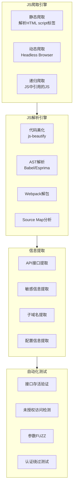

#### 5.1 JS文件爬取引擎

**静态爬取：**

- 解析HTML中的`<script src="...">`标签
- 正则匹配JS文件URL
- 递归爬取（JS中引用的其他JS）

**动态爬取（Headless Browser）：**

- 使用Puppeteer/Playwright渲染页面
- 监控Network请求获取动态加载的JS
- 处理Webpack/Vite等打包工具的chunk文件
- 支持SPA应用的路由切换

**推荐工具：**

| 工具      | 特点                               |
| --------- | ---------------------------------- |
| Katana    | ProjectDiscovery出品，支持Headless |
| gospider  | Go开发，速度快                     |
| hakrawler | 简单高效的爬虫                     |

#### 5.2 JS文件解析引擎

| 功能        | 说明                                                  |
| ----------- | ----------------------------------------------------- |
| 代码美化    | 处理压缩/混淆的JS代码，使用js-beautify格式化          |
| AST解析     | 使用Babel/Esprima解析JS语法树，提取函数调用、变量定义 |
| Webpack解包 | 识别Webpack打包特征，提取各模块源码，还原原始文件结构 |
| Source Map  | 检测.map文件，解析还原源代码                          |

#### 5.3 API接口提取

**URL/路径提取正则：**

| 类型        | 正则表达式                            |
| ----------- | ------------------------------------- |
| 绝对URL     | `https?://[^\s"'<>]+`                 |
| 相对路径    | `/api/[^\s"'<>]+`                     |
| API端点     | `/v[0-9]+/[^\s"'<>]+`                 |
| RESTful路径 | `/(users|orders|products)/[^\s"'<>]*` |

**推荐工具：**

| 工具           | 用途                      |
| -------------- | ------------------------- |
| LinkFinder     | 经典JS链接提取工具        |
| JSFinder       | 国产工具，提取URL和子域名 |
| URLFinder      | JSFinder升级版，更快更全  |
| SecretFinder   | 专注敏感信息提取          |
| jjjjjjjjjjjjjs | 针对Webpack站点，自动FUZZ |

#### 5.4 敏感信息提取

**敏感信息类型及正则规则：**

| 类型            | 正则表达式                                               |
| --------------- | -------------------------------------------------------- |
| AWS Access Key  | `AKIA[0-9A-Z]{16}`                                       |
| AWS Secret Key  | `[0-9a-zA-Z/+=]{40}`                                     |
| 阿里云AccessKey | `LTAI[0-9a-zA-Z]{12,20}`                                 |
| 腾讯云SecretId  | `AKID[0-9a-zA-Z]{32}`                                    |
| Google API      | `AIza[0-9A-Za-z_-]{35}`                                  |
| GitHub Token    | `gh[pousr]_[0-9a-zA-Z]{36}`                              |
| Slack Token     | `xox[baprs]-[0-9a-zA-Z-]+`                               |
| JWT Token       | `eyJ[a-zA-Z0-9_-]+\.eyJ[a-zA-Z0-9_-]+\.[a-zA-Z0-9_-]+`   |
| 内网IP          | `(10\.|172\.(1[6-9]|2[0-9]|3[01])\.|192\.168\.)\d+\.\d+` |
| 邮箱地址        | `[a-zA-Z0-9._%+-]+@[a-zA-Z0-9.-]+\.[a-zA-Z]{2,}`         |
| 手机号码        | `1[3-9]\d{9}`                                            |

#### 5.5 API接口自动化测试流程

mermaid

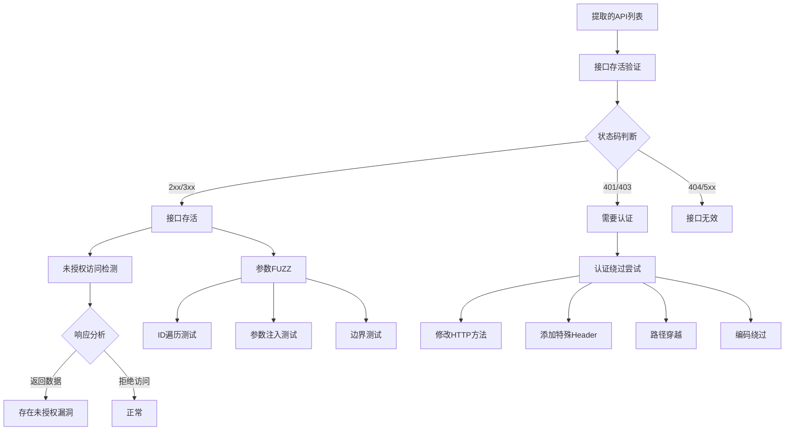

#### 5.6 JS分析完整工作流

mermaid

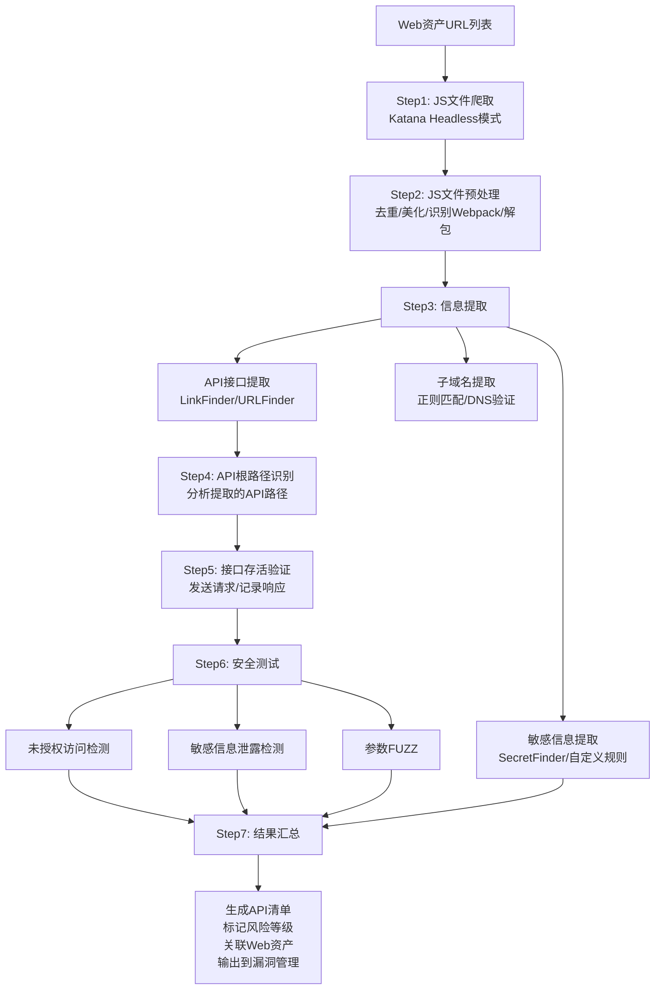

### 3.7 模块六：漏洞扫描模块

#### 功能描述

对发现的资产进行自动化漏洞扫描。

#### 模块架构

mermaid

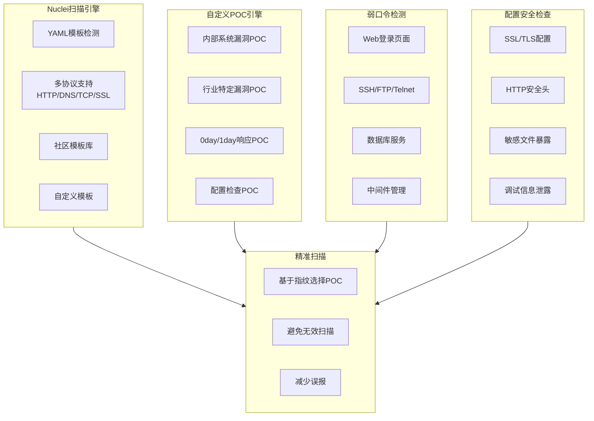

#### 6.1 Nuclei扫描引擎

**核心能力：**

- 基于YAML模板的漏洞检测
- 支持HTTP/DNS/TCP/SSL等多种协议
- 丰富的社区模板库（nuclei-templates）
- 支持自定义模板

**扫描策略：**

bash

```bash
# 按严重程度
nuclei -s critical,high,medium

# 按类型
nuclei -t cves,vulnerabilities,exposures

# 按标签
nuclei -tags rce,sqli,xss,lfi

# 排除规则
nuclei -exclude-tags dos,fuzz
```

#### 6.2 Nuclei分布式扫描架构

mermaid

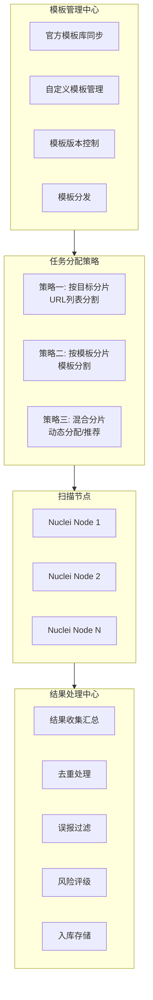

#### 6.3 弱口令检测

**检测目标：**

| 类型     | 目标                                 |
| -------- | ------------------------------------ |
| Web服务  | 登录页面                             |
| 远程服务 | SSH/FTP/Telnet                       |
| 数据库   | MySQL/MSSQL/PostgreSQL/Redis/MongoDB |
| 中间件   | Tomcat Manager/WebLogic Console      |
| 其他     | VNC/RDP/SMB                          |

**字典策略：**

- 通用弱口令字典
- 公司特定字典（公司名、域名相关）
- 历史泄露密码
- 社工字典生成

#### 6.4 基于指纹的精准扫描

| 识别指纹 | 扫描POC              |
| -------- | -------------------- |
| ThinkPHP | ThinkPHP相关漏洞     |
| Struts2  | S2-xxx系列漏洞       |
| WebLogic | WebLogic反序列化漏洞 |
| Spring   | Spring相关漏洞       |
| Fastjson | Fastjson反序列化漏洞 |

### 3.8 模块七：数据融合与报告模块

#### 功能描述

整合各模块数据，提供统一视图和报告输出。

#### 模块架构

mermaid

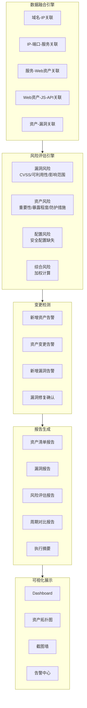

#### 7.1 数据融合引擎

**资产关联关系：**

- 域名 ↔ IP关联
- IP ↔ 端口 ↔ 服务关联
- 服务 ↔ Web资产关联
- Web资产 ↔ JS文件关联
- Web资产 ↔ API接口关联
- 资产 ↔ 漏洞关联

**去重策略：**

| 类型 | 去重方式               |
| ---- | ---------------------- |
| 域名 | 基于FQDN               |
| IP   | 基于IP地址             |
| URL  | 基于规范化URL          |
| 漏洞 | 基于漏洞类型+目标+参数 |

#### 7.2 风险评估引擎

**风险等级：**

| 等级             | 分数范围 | 说明       |
| ---------------- | -------- | ---------- |
| 严重（Critical） | 9.0-10.0 | 需立即处理 |
| 高危（High）     | 7.0-8.9  | 需优先处理 |
| 中危（Medium）   | 4.0-6.9  | 需计划处理 |
| 低危（Low）      | 0.1-3.9  | 可延后处理 |
| 信息（Info）     | 0        | 仅供参考   |

#### 7.3 告警机制

| 渠道               | 说明             |
| ------------------ | ---------------- |
| 邮件通知           | 支持邮件模板定制 |
| 企业微信/钉钉/飞书 | 机器人推送       |
| Webhook回调        | 自定义集成       |
| 短信告警           | 高危漏洞专用     |

#### 7.4 报告输出格式

| 格式     | 用途       |
| -------- | ---------- |
| PDF      | 正式报告   |
| HTML     | 交互式报告 |
| Excel    | 数据导出   |
| JSON/CSV | 数据接口   |

------

## 四、工作流编排设计

### 4.1 完整扫描工作流

mermaid

```mermaid
flowchart TB
    START[开始扫描] --> P1

    subgraph P1[Phase 1: 资产输入与初始化]
        P1A[加载项目配置]
        P1B[导入用户资产]
        P1C[加载排除列表]
        P1D[初始化扫描任务]
    end

    P1 --> P2

    subgraph P2[Phase 2: 子域名收集]
        P2A[Subfinder被动收集]
        P2B[FOFA/Hunter空间搜索]
        P2C[Ksubdomain主动爆破]
        P2D[证书透明度查询]
        P2E[结果合并去重]
        P2F[DNS解析验证]
        P2G[泛解析处理]
    end

    P2 --> P3

    subgraph P3[Phase 3: IP资产整理]
        P3A[提取子域名解析IP]
        P3B[合并用户IP列表]
        P3C[IP去重]
        P3D[CDN IP识别标记]
    end

    P3 --> P4

    subgraph P4[Phase 4: 端口扫描与服务识别]
        P4A[Masscan快速端口发现]
        P4B[Nmap服务识别]
        P4C[Banner抓取]
    end

    P4 --> P5

    subgraph P5[Phase 5: Web资产探测]
        P5A[httpx批量探测]
        P5B[指纹识别]
        P5C[截图]
    end

    P5 --> P6A
    P5 --> P6B

    subgraph P6A[Phase 6a: 目录扫描]
        P6A1[ffuf/dirsearch]
        P6A2[敏感文件检测]
    end

    subgraph P6B[Phase 6b: JS分析]
        P6B1[JS文件爬取]
        P6B2[API接口提取]
        P6B3[敏感信息提取]
        P6B4[未授权检测]
    end

    P6A --> P7
    P6B --> P7

    subgraph P7[Phase 7: 漏洞扫描]
        P7A[Nuclei漏洞扫描]
        P7B[弱口令检测]
        P7C[配置安全检查]
        P7D[自定义POC扫描]
    end

    P7 --> P8

    subgraph P8[Phase 8: 数据处理与报告]
        P8A[结果汇总入库]
        P8B[数据关联]
        P8C[风险评估]
        P8D[变更检测]
        P8E[生成报告]
        P8F[发送告警通知]
    end

    P8 --> END[扫描完成]
```

### 4.2 任务依赖关系图

mermaid

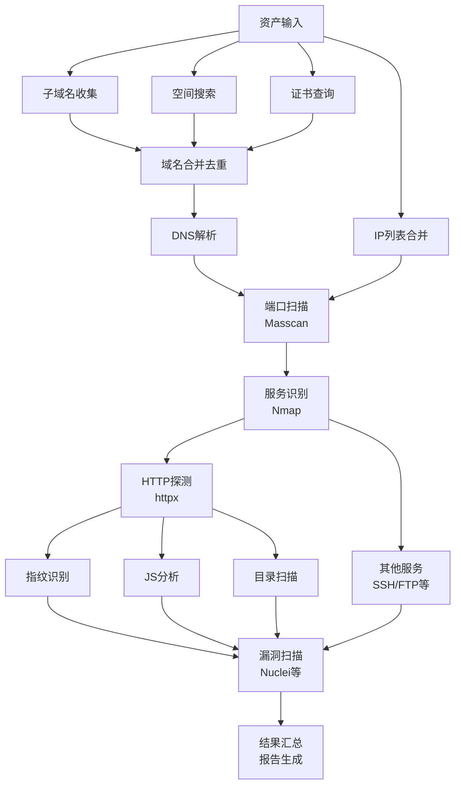

------

## 五、数据模型设计

### 5.1 核心实体关系图

mermaid

```mermaid
erDiagram
    Project ||--o{ RootDomain : contains
    Project ||--o{ IPRange : contains
    Project ||--o{ ExcludeList : contains
    
    RootDomain ||--o{ Subdomain : has
    
    Subdomain }o--|| IPAddress : resolves_to
    
    IPAddress ||--o{ Port : has
    
    Port ||--o{ Service : runs
    
    Service ||--o| WebAsset : serves
    
    WebAsset ||--o{ JSFile : contains
    WebAsset ||--o{ APIEndpoint : exposes
    WebAsset ||--o{ Directory : has
    WebAsset ||--o| Screenshot : captures
    
    JSFile ||--o{ SensitiveInfo : contains
    JSFile ||--o{ APIEndpoint : references
    
    Project ||--o{ Vulnerability : has
    Subdomain ||--o{ Vulnerability : affected_by
    IPAddress ||--o{ Vulnerability : affected_by
    Port ||--o{ Vulnerability : affected_by
    WebAsset ||--o{ Vulnerability : affected_by
    APIEndpoint ||--o{ Vulnerability : affected_by

    Project {
        uuid id PK
        string name
        text description
        jsonb scan_policy
        jsonb notification_config
        string status
        timestamp created_at
        timestamp updated_at
    }

    RootDomain {
        uuid id PK
        uuid project_id FK
        string domain
        string source
        string status
        timestamp created_at
    }

    Subdomain {
        uuid id PK
        uuid project_id FK
        uuid root_domain_id FK
        string subdomain
        string source
        jsonb ip_addresses
        text cname
        boolean is_cdn
        string cdn_provider
        timestamp first_seen
        timestamp last_seen
    }

    IPAddress {
        uuid id PK
        uuid project_id FK
        string ip
        string source
        string asn
        string asn_org
        string country
        boolean is_cdn
        timestamp first_seen
        timestamp last_seen
    }

    Port {
        uuid id PK
        uuid ip_id FK
        integer port
        string protocol
        string state
        string service
        string version
        text banner
        timestamp first_seen
        timestamp last_seen
    }

    WebAsset {
        uuid id PK
        uuid project_id FK
        string url
        uuid subdomain_id FK
        uuid ip_id FK
        uuid port_id FK
        string title
        integer status_code
        integer content_length
        string server
        jsonb technologies
        jsonb fingerprints
        string screenshot_path
        boolean is_alive
        timestamp first_seen
        timestamp last_seen
    }

    JSFile {
        uuid id PK
        uuid web_asset_id FK
        string url
        string content_hash
        integer file_size
        boolean is_webpack
        string source_map_url
        boolean has_source_map
        string analysis_status
        timestamp first_seen
        timestamp last_seen
    }

    APIEndpoint {
        uuid id PK
        uuid web_asset_id FK
        uuid js_file_id FK
        string path
        string method
        string full_url
        jsonb parameters
        boolean is_alive
        integer response_status
        boolean is_authenticated
        boolean has_unauthorized_access
        timestamp first_seen
        timestamp last_seen
    }

    SensitiveInfo {
        uuid id PK
        string source_type
        uuid source_id
        string info_type
        text value
        text context
        boolean is_verified
        string risk_level
        timestamp created_at
    }

    Vulnerability {
        uuid id PK
        uuid project_id FK
        string target_type
        uuid target_id
        string target_url
        string vuln_type
        string vuln_name
        string severity
        decimal cvss_score
        string cve_id
        text description
        text evidence
        text request
        text response
        text remediation
        string scanner
        string template_id
        boolean is_false_positive
        string status
        timestamp first_seen
        timestamp last_seen
    }
```

### 5.2 核心数据表SQL

sql

```sql
-- 项目表
CREATE TABLE project (
    id UUID PRIMARY KEY,
    name VARCHAR(255) NOT NULL,
    description TEXT,
    scan_policy JSONB,
    notification_config JSONB,
    status VARCHAR(50) DEFAULT 'active',
    created_at TIMESTAMP DEFAULT NOW(),
    updated_at TIMESTAMP DEFAULT NOW()
);

-- 主域名表
CREATE TABLE root_domain (
    id UUID PRIMARY KEY,
    project_id UUID REFERENCES project(id),
    domain VARCHAR(255) NOT NULL,
    source VARCHAR(50),
    status VARCHAR(50) DEFAULT 'active',
    created_at TIMESTAMP DEFAULT NOW(),
    UNIQUE(project_id, domain)
);

-- 子域名表
CREATE TABLE subdomain (
    id UUID PRIMARY KEY,
    project_id UUID REFERENCES project(id),
    root_domain_id UUID REFERENCES root_domain(id),
    subdomain VARCHAR(255) NOT NULL,
    source VARCHAR(50),
    ip_addresses JSONB,
    cname TEXT,
    is_cdn BOOLEAN DEFAULT FALSE,
    cdn_provider VARCHAR(100),
    first_seen TIMESTAMP DEFAULT NOW(),
    last_seen TIMESTAMP DEFAULT NOW(),
    status VARCHAR(50) DEFAULT 'active',
    UNIQUE(project_id, subdomain)
);

-- IP地址表
CREATE TABLE ip_address (
    id UUID PRIMARY KEY,
    project_id UUID REFERENCES project(id),
    ip VARCHAR(45) NOT NULL,
    source VARCHAR(50),
    asn VARCHAR(50),
    asn_org VARCHAR(255),
    country VARCHAR(10),
    region VARCHAR(100),
    city VARCHAR(100),
    is_cdn BOOLEAN DEFAULT FALSE,
    first_seen TIMESTAMP DEFAULT NOW(),
    last_seen TIMESTAMP DEFAULT NOW(),
    UNIQUE(project_id, ip)
);

-- 端口表
CREATE TABLE port (
    id UUID PRIMARY KEY,
    ip_id UUID REFERENCES ip_address(id),
    port INTEGER NOT NULL,
    protocol VARCHAR(10) DEFAULT 'tcp',
    state VARCHAR(20),
    service VARCHAR(100),
    version VARCHAR(255),
    banner TEXT,
    first_seen TIMESTAMP DEFAULT NOW(),
    last_seen TIMESTAMP DEFAULT NOW(),
    UNIQUE(ip_id, port, protocol)
);

-- Web资产表
CREATE TABLE web_asset (
    id UUID PRIMARY KEY,
    project_id UUID REFERENCES project(id),
    url VARCHAR(2048) NOT NULL,
    subdomain_id UUID REFERENCES subdomain(id),
    ip_id UUID REFERENCES ip_address(id),
    port_id UUID REFERENCES port(id),
    title VARCHAR(500),
    status_code INTEGER,
    content_length INTEGER,
    content_type VARCHAR(255),
    server VARCHAR(255),
    technologies JSONB,
    fingerprints JSONB,
    screenshot_path VARCHAR(500),
    response_hash VARCHAR(64),
    is_alive BOOLEAN DEFAULT TRUE,
    first_seen TIMESTAMP DEFAULT NOW(),
    last_seen TIMESTAMP DEFAULT NOW(),
    UNIQUE(project_id, url)
);

-- JS文件表
CREATE TABLE js_file (
    id UUID PRIMARY KEY,
    web_asset_id UUID REFERENCES web_asset(id),
    url VARCHAR(2048) NOT NULL,
    content_hash VARCHAR(64),
    file_size INTEGER,
    is_webpack BOOLEAN DEFAULT FALSE,
    source_map_url VARCHAR(2048),
    has_source_map BOOLEAN DEFAULT FALSE,
    analysis_status VARCHAR(50),
    first_seen TIMESTAMP DEFAULT NOW(),
    last_seen TIMESTAMP DEFAULT NOW()
);

-- API接口表
CREATE TABLE api_endpoint (
    id UUID PRIMARY KEY,
    web_asset_id UUID REFERENCES web_asset(id),
    js_file_id UUID REFERENCES js_file(id),
    path VARCHAR(2048) NOT NULL,
    method VARCHAR(10),
    full_url VARCHAR(2048),
    parameters JSONB,
    is_alive BOOLEAN,
    response_status INTEGER,
    response_length INTEGER,
    is_authenticated BOOLEAN,
    has_unauthorized_access BOOLEAN,
    first_seen TIMESTAMP DEFAULT NOW(),
    last_seen TIMESTAMP DEFAULT NOW()
);

-- 敏感信息表
CREATE TABLE sensitive_info (
    id UUID PRIMARY KEY,
    source_type VARCHAR(50),
    source_id UUID,
    info_type VARCHAR(100),
    value TEXT,
    context TEXT,
    is_verified BOOLEAN DEFAULT FALSE,
    risk_level VARCHAR(20),
    created_at TIMESTAMP DEFAULT NOW()
);

-- 漏洞表
CREATE TABLE vulnerability (
    id UUID PRIMARY KEY,
    project_id UUID REFERENCES project(id),
    target_type VARCHAR(50),
    target_id UUID,
    target_url VARCHAR(2048),
    vuln_type VARCHAR(100),
    vuln_name VARCHAR(255),
    severity VARCHAR(20),
    cvss_score DECIMAL(3,1),
    cve_id VARCHAR(50),
    description TEXT,
    evidence TEXT,
    request TEXT,
    response TEXT,
    remediation TEXT,
    scanner VARCHAR(50),
    template_id VARCHAR(255),
    is_false_positive BOOLEAN DEFAULT FALSE,
    status VARCHAR(50) DEFAULT 'open',
    first_seen TIMESTAMP DEFAULT NOW(),
    last_seen TIMESTAMP DEFAULT NOW()
);

-- 扫描任务表
CREATE TABLE scan_task (
    id UUID PRIMARY KEY,
    project_id UUID REFERENCES project(id),
    task_type VARCHAR(50),
    status VARCHAR(50),
    progress INTEGER DEFAULT 0,
    total_targets INTEGER,
    completed_targets INTEGER DEFAULT 0,
    config JSONB,
    started_at TIMESTAMP,
    completed_at TIMESTAMP,
    error_message TEXT,
    created_at TIMESTAMP DEFAULT NOW()
);

-- 索引
CREATE INDEX idx_subdomain_project ON subdomain(project_id);
CREATE INDEX idx_subdomain_root ON subdomain(root_domain_id);
CREATE INDEX idx_ip_project ON ip_address(project_id);
CREATE INDEX idx_port_ip ON port(ip_id);
CREATE INDEX idx_web_asset_project ON web_asset(project_id);
CREATE INDEX idx_vulnerability_project ON vulnerability(project_id);
CREATE INDEX idx_vulnerability_severity ON vulnerability(severity);
CREATE INDEX idx_vulnerability_status ON vulnerability(status);
```

------

## 六、技术选型建议

### 6.1 技术栈推荐

#### 后端技术栈

| 组件     | 推荐方案       | 说明                             |
| -------- | -------------- | -------------------------------- |
| 语言     | Python         | 生态丰富，开发效率高，安全工具多 |
| Web框架  | FastAPI        | 异步支持好，自动文档             |
| 任务队列 | Celery + Redis | 成熟稳定，功能丰富               |
| ORM      | SQLAlchemy     | Python标准ORM                    |

#### 前端技术栈

| 组件     | 推荐方案                      |
| -------- | ----------------------------- |
| 框架     | Vue 3 + TypeScript            |
| UI组件   | Element Plus / Ant Design Vue |
| 图表     | ECharts                       |
| 状态管理 | Pinia                         |
| 构建工具 | Vite                          |

#### 数据存储

| 组件      | 推荐方案         | 说明                       |
| --------- | ---------------- | -------------------------- |
| 主数据库  | PostgreSQL       | JSONB支持，性能优秀        |
| 缓存/队列 | Redis            | 任务队列、缓存、分布式锁   |
| 搜索引擎  | Elasticsearch    | 日志存储、全文搜索（可选） |
| 文件存储  | MinIO / 本地存储 | JS文件、截图、报告存储     |

#### 部署方案

| 组件     | 推荐方案                |
| -------- | ----------------------- |
| 容器化   | Docker + Docker Compose |
| 编排     | Kubernetes (大规模部署) |
| 反向代理 | Nginx                   |
| 监控     | Prometheus + Grafana    |

### 6.2 扫描工具集成清单

| 模块       | 工具       | 语言   | 用途     | 集成方式     |
| ---------- | ---------- | ------ | -------- | ------------ |
| 子域名收集 | Subfinder  | Go     | 被动收集 | CLI调用      |
| 子域名收集 | Amass      | Go     | 综合收集 | CLI调用      |
| 子域名收集 | OneForAll  | Python | 综合收集 | Python库     |
| 子域名爆破 | Ksubdomain | Go     | DNS爆破  | CLI调用      |
| DNS解析    | DNSx       | Go     | 批量解析 | CLI调用      |
| 端口扫描   | Masscan    | C      | 快速扫描 | CLI调用      |
| 服务识别   | Nmap       | C      | 服务识别 | CLI/Python库 |
| HTTP探测   | httpx      | Go     | Web探测  | CLI调用      |
| 指纹识别   | EHole      | Go     | 国产指纹 | CLI调用      |
| 指纹识别   | WhatWeb    | Ruby   | 综合指纹 | CLI调用      |
| 目录扫描   | ffuf       | Go     | 目录FUZZ | CLI调用      |
| 目录扫描   | dirsearch  | Python | 目录扫描 | Python库     |
| JS爬取     | Katana     | Go     | 爬虫     | CLI调用      |
| JS分析     | LinkFinder | Python | 接口提取 | Python库     |
| JS分析     | URLFinder  | Go     | 接口提取 | CLI调用      |
| 漏洞扫描   | Nuclei     | Go     | POC扫描  | CLI调用      |
| 截图       | gowitness  | Go     | 网页截图 | CLI调用      |

### 6.3 技术架构图

mermaid

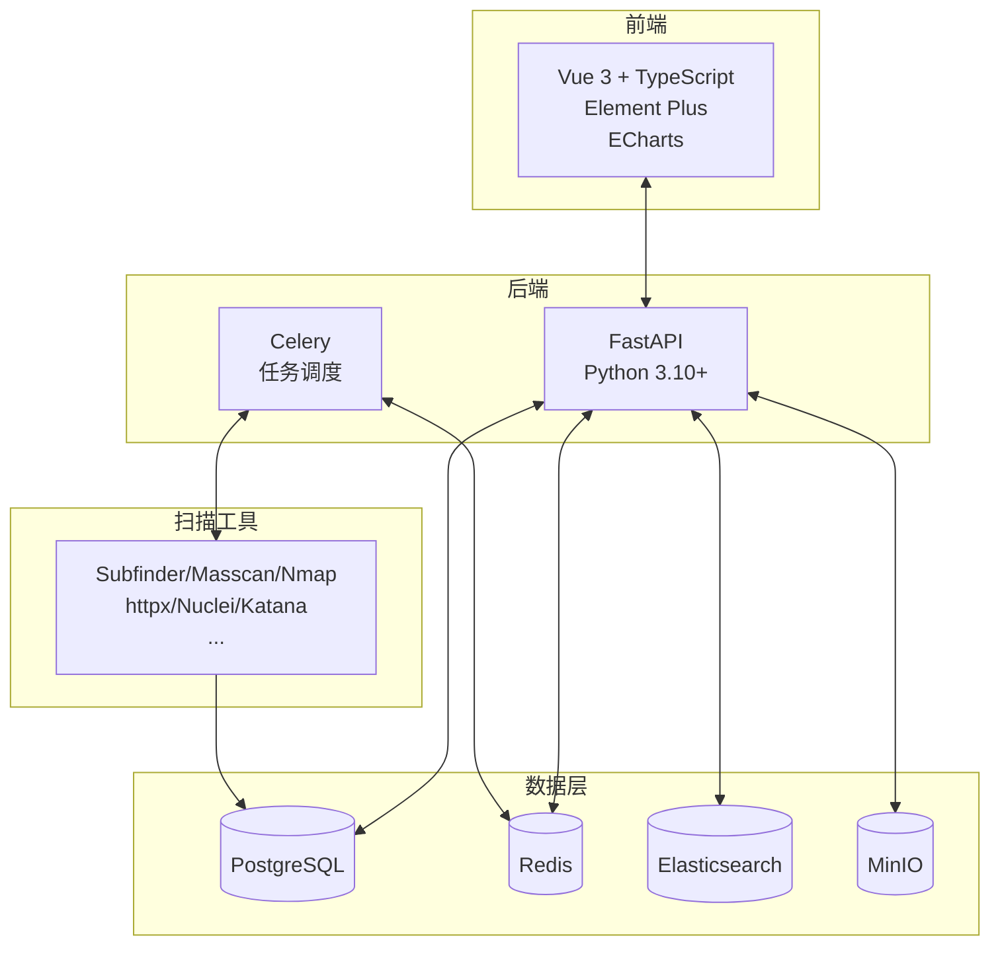

------

## 七、其他建议模块

### 7.1 资产监控与告警模块

mermaid

```mermaid
graph LR
    subgraph 监控能力
        M1[新资产发现告警]
        M2[资产变更告警]
        M3[证书监控]
        M4[漏洞告警]
        M5[定时扫描]
    end

    subgraph 告警渠道
        A1[邮件通知]
        A2[企业微信/钉钉/飞书]
        A3[Webhook回调]
        A4[短信告警]
        A5[SIEM/SOC对接]
    end

    监控能力 --> 告警渠道
```

### 7.2 GitHub/代码仓库监控模块

| 监控内容     | 说明                                |
| ------------ | ----------------------------------- |
| 公司代码泄露 | 监控GitHub/GitLab/Gitee上的公司代码 |
| 敏感信息泄露 | API Key、密码、内部域名、配置文件   |
| 员工仓库     | 监控员工个人仓库中的公司相关信息    |
| 子域名发现   | 从代码中提取子域名信息              |

**推荐工具：**

- GitDorker：GitHub敏感信息搜索
- truffleHog：Git仓库敏感信息扫描

### 7.3 威胁情报集成模块

| 情报来源     | 用途                   |
| ------------ | ---------------------- |
| CVE/NVD      | 漏洞情报               |
| Exploit-DB   | 漏洞利用代码           |
| 安全公告     | 厂商安全公告监控       |
| 威胁情报平台 | VirusTotal、微步在线等 |

### 7.4 API安全测试模块

| 测试能力            | 说明                            |
| ------------------- | ------------------------------- |
| OpenAPI/Swagger解析 | 自动解析API文档                 |
| 认证测试            | JWT安全、OAuth安全、API Key安全 |
| 授权测试            | 水平越权、垂直越权、IDOR        |
| 输入验证            | SQL注入、XSS、命令注入          |
| 业务逻辑            | 参数篡改、流程绕过              |
| 速率限制            | 暴力破解、CC攻击                |

### 7.5 资产画像模块

| 画像维度 | 内容                         |
| -------- | ---------------------------- |
| 基础信息 | 域名、IP、端口、服务         |
| 技术栈   | 语言、框架、中间件、数据库   |
| 业务属性 | 所属业务线、负责人、重要程度 |
| 安全属性 | 漏洞数量、风险等级、防护措施 |
| 历史信息 | 变更历史、扫描历史           |

------

## 八、开发路线图建议

### 8.1 分阶段实施计划

mermaid

```mermaid
gantt
    title EASM系统开发路线图
    dateFormat  YYYY-MM-DD
    section Phase 1 MVP版本
    项目管理基础功能           :p1a, 2024-01-01, 1w
    资产导入功能               :p1b, after p1a, 1w
    子域名收集模块             :p1c, after p1b, 2w
    端口扫描模块               :p1d, after p1c, 2w
    HTTP探测模块               :p1e, after p1d, 1w
    基础漏洞扫描               :p1f, after p1e, 1w
    简单Web界面                :p1g, after p1f, 1w
    
    section Phase 2 功能完善
    分布式扫描架构             :p2a, after p1g, 2w
    指纹识别模块               :p2b, after p2a, 1w
    目录扫描模块               :p2c, after p2b, 1w
    JS分析基础版               :p2d, after p2c, 2w
    数据融合与去重             :p2e, after p2d, 1w
    报告生成                   :p2f, after p2e, 1w
    
    section Phase 3 JS分析深化
    Headless爬虫               :p3a, after p2f, 2w
    Webpack解包                :p3b, after p3a, 1w
    API自动化测试              :p3c, after p3b, 2w
    敏感信息深度提取           :p3d, after p3c, 1w
    未授权访问检测             :p3e, after p3d, 1w
    
    section Phase 4 高级功能
    资产监控与告警             :p4a, after p3e, 2w
    变更检测                   :p4b, after p4a, 1w
    GitHub监控                 :p4c, after p4b, 1w
    威胁情报集成               :p4d, after p4c, 1w
    可视化Dashboard            :p4e, after p4d, 2w
```

### 8.2 各阶段详细说明

#### Phase 1: MVP版本 (4-6周)

**核心功能：**

- 项目管理基础功能
- 资产导入（域名、IP）
- 子域名收集（Subfinder + 空间搜索引擎）
- 端口扫描（Masscan + Nmap）
- HTTP探测（httpx）
- 基础漏洞扫描（Nuclei）
- 简单的Web管理界面

**技术目标：**

- 单机部署
- 基础任务队列
- 数据库设计完成

#### Phase 2: 功能完善 (4-6周)

**新增功能：**

- 分布式扫描架构
- 指纹识别模块
- 目录扫描模块
- JS分析模块（基础版）
- 数据融合与去重
- 报告生成

**技术目标：**

- 多节点部署
- 任务调度优化
- 性能优化

#### Phase 3: JS分析深化 (4-6周)

**重点功能：**

- Headless爬虫（处理SPA）
- Webpack解包
- API接口自动化测试
- 敏感信息深度提取
- Source Map分析
- 未授权访问检测

#### Phase 4: 高级功能 (4-6周)

**新增功能：**

- 资产监控与告警
- 变更检测
- GitHub监控
- 威胁情报集成
- 可视化Dashboard
- API对外开放

#### Phase 5: 持续优化

- 性能优化
- 误报优化
- 自定义POC管理
- 与内部系统集成（CMDB、工单系统等）
- 用户体验优化

------

## 九、总结

### 9.1 系统核心价值

| 价值                 | 说明                                                         |
| -------------------- | ------------------------------------------------------------ |
| **全面的资产发现**   | 通过多种方式（被动收集、主动爆破、空间搜索）全面发现互联网暴露资产 |
| **深度的安全检测**   | 不仅扫描已知漏洞，还通过JS分析发现隐藏的API和敏感信息        |
| **持续的安全监控**   | 周期性扫描，及时发现新增资产和新增风险                       |
| **高效的分布式架构** | 支持大规模资产的快速扫描                                     |

### 9.2 与需求的对应

| 需求                   | 对应模块        | 实现方案                           |
| ---------------------- | --------------- | ---------------------------------- |
| 分布式扫描             | 任务调度层      | Celery + Redis + 多Agent节点       |
| 子域名收集和爆破       | 子域名收集模块  | Subfinder + Ksubdomain + FOFA      |
| IP和子域名合并去重     | 数据融合模块    | 基于数据库的去重 + 来源标记        |
| 端口扫描和服务识别     | 端口扫描模块    | Masscan + Nmap 两阶段扫描          |
| HTTP服务识别           | Web资产探测模块 | httpx                              |
| 目录暴力破解和指纹识别 | Web资产探测模块 | ffuf + EHole/WhatWeb               |
| JS文件爬取分析（重点） | JS分析模块      | Katana + LinkFinder + 自研分析引擎 |
| Nuclei漏洞扫描         | 漏洞扫描模块    | Nuclei分布式扫描                   |

### 9.3 下一步建议

1. **确认技术栈**：建议使用 Python + FastAPI + Celery + PostgreSQL
2. **搭建基础框架**：先搭建任务调度和数据存储的基础框架
3. **逐步集成工具**：按照优先级逐步集成各个扫描工具
4. **重点攻克JS分析**：这是最有价值也最有挑战的部分